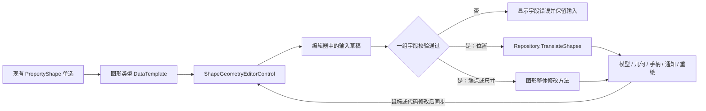

# 0001 — 属性面板几何编辑

**Date:** 2026-10-06

**Status:** Accepted

**Author:** Architect Agent

**Related ADRs:** [WPF 原生画板架构](../adr/0001-wpf-native-sketch-architecture.md)、[属性面板几何编辑](../adr/0002-property-panel-geometry-editing.md)

## 问题

`ImageViewerControl.xaml` 的属性区通过 `PropertyShape` 显示单个图形，具体字段位于 `PropertyPanelTheme.xaml` 的类型模板中。圆的半径和矩形的宽高已可编辑，但线段的端点、矩形的位置和圆心只读，线段没有长度编辑项。直接改成双向绑定不足以定义几何操作：移动矩形左上角应保持宽高，修改线段长度应确定固定端点，输入中的非法或不完整数值不能进入真实图形。此外，需要保持绘制几何、手柄、选择框、通知和导出数据一致。

## 实施前代码依据

下表行号对应设计时的源码；实施后的入口和行为见 [使用说明](../shape-geometry-editing.md)。

| 位置 | 已确认行为 | 对设计的影响 |
| --- | --- | --- |
| `src/Lan.ImageViewer/ImageViewerControl.xaml:529` | `ContentControl.Content` 绑定 `PropertyShape` | 继续使用现有类型模板和单选入口 |
| `src/Lan.ImageViewer/PropertyPanelTheme.xaml:224` | 圆半径可编辑；圆心只读 | 替换几何字段，保留 Tag 和锁定 |
| `src/Lan.ImageViewer/PropertyPanelTheme.xaml:294` | 矩形宽高可编辑；两个角只读 | 明确位置和大小是不同操作 |
| `src/Lan.ImageViewer/PropertyPanelTheme.xaml:500` | 线段起终点只读；没有长度项 | 增加长度及端点编辑 |
| `src/Lan.ImageViewer.Prism/ImageViewerControlViewModel.cs:198` | `PropertyShape` 仅在单选时非空 | 第一版沿用单选；组合先解组 |
| `src/Lan.Shapes/Shapes/Line.cs:47` | `Start`、`End` 更新模型和线几何 | 输入适配层提供标量字段；不能直接编辑 `Point.X/Y` |
| `src/Lan.Shapes/Shapes/Rectangle.cs:96` | 设置 `TopLeft` 保持原 `BottomRight` | 面板位置编辑应平移两个角 |
| `src/Lan.Shapes/Shapes/Rectangle.cs:54` | 宽高取两角差的绝对值，setter 固定原始 `TopLeft` | 原始点可能倒序；面板应使用归一化的几何左上角 |
| `src/Lan.Shapes/Shapes/Circle.cs:89` | `X/Y` 保存独立字段；设置 `Center` 不同步它们 | 将 `X/Y` 改为 `Center` 的派生包装并补通知 |
| `src/Lan.Shapes/ShapeVisualBase.cs:91` | `Translate` 同步模型、附加文本、手柄和边界通知 | 纯位置修改复用平移流程 |
| `src/Lan.Shapes/ShapeVisualBase.cs:820` | `DeferVisualUpdates` 合并重绘 | 单次提交只绘制最终几何；该机制本身不延迟属性通知 |
| `src/Lan.Shapes/ShapeVisualBase.cs:744` | `SetField` 在后续几何更新之前发通知 | 新的整体修改方法应在字段和几何更新完成后发通知 |

## 建议方案

在 `Lan.ImageViewer` 增加 `ShapeGeometryEditorControl`，由它管理几何输入草稿和提交。控件接收现有 `PropertyShape` 对应的图形及 `IShapeRepository`，内部使用三个轻量编辑器：`LineGeometryEditor`、`RectangleGeometryEditor`、`CircleGeometryEditor`。几何算法和真实状态更新仍放在 `Lan.Shapes`，符合现有 WPF 原生架构。

不需要新增必需的 `IImageViewerViewModel` 成员，也不要求宿主使用 Prism。几何编辑区嵌入当前三种图形模板，替换各自原有的几何字段，保留 Tag、锁定、图层和组合操作。其他类型继续使用已有模板。



### 字段及操作语义

所有可编辑数字第一版使用 **图像/画板坐标，单位 px**，允许小数。原点在图像左上角，X 向右、Y 向下。视口缩放和平移不改变这些数字。标定后的物理单位可以显示为只读参考值；第一版不提供单位切换，避免把缩放、标定与几何长度混在一起。

| 图形 | 字段 | 确认修改后的行为 |
| --- | --- | --- |
| 线段 | 起点 X、Y | 仅修改起点，保持终点；刷新长度 |
| 线段 | 终点 X、Y | 仅修改终点，保持起点；刷新长度 |
| 线段 | 长度 | 固定起点和现有方向，移动终点 |
| 矩形 | 左上角 X、Y | 整体平移，保持宽高，附加文本一同移动 |
| 矩形 | 宽、高 | 固定几何左上角，改变右下角 |
| 矩形 | 右下角（只读） | 由左上角和宽高计算 |
| 圆 | 圆心 X、Y | 整体平移，保持半径，附加文本一同移动 |
| 圆 | 半径 | 固定圆心，改变半径 |
| 圆 | 直径（只读） | `2 × 半径` |

线段修改长度采用：

```text
direction = (End - Start) / |End - Start|
newEnd = Start + direction × newLength
```

例如起点 `(10, 20)`、终点 `(40, 60)`，当前长度为 `50 px`；改成 `100 px` 后终点为 `(70, 100)`，起点不变。界面在长度旁注明“固定起点，保持方向”。第一版不增加锚点选项或额外角度字段，避免与当前画布上 0–90° 的测量倾角混淆。

矩形读取位置时使用 `new Rect(rectangle.TopLeft, rectangle.BottomRight).TopLeft`，不能假定名为 `TopLeft` 的原始字段必然是几何左上角；从右下向左上绘制或导入的数据可能倒序。大小修改的整体方法使用归一化的 `Rect`，写入规范化的两个角；当前 `GetMetaData` 已从 `RectangleGeometry.Rect` 导出规范化两角，无需改变导出契约。只改位置则走平移，保留内部原始两角顺序。

### 输入与提交

建议采用“一组字段对应一次几何操作”：线段起点、线段终点、矩形位置、矩形大小、圆心各是一组；长度和半径各是一组。

- 输入绑定到编辑器的字符串草稿，允许暂时出现空文本、负号或未完成的小数；不会在每次按键时更新真实模型。
- `Enter` 提交当前组；焦点离开整组时也尝试提交。X 到同组 Y、宽到同组高的 Tab 移动不提交。失焦提交排到当前输入事件完成后执行，避免画布先获取焦点、随后才改选时误提交旧草稿。
- `Esc` 恢复当前组的真实值。校验失败保留草稿、显示错误，真实图形保持原状；再次选择该图形从真实值重新读取。
- 提交前重新校验当前选中图形、成员关系、锁定、可见性和绘制状态，避免选中对象已经被删除或改变。
- 对合法提交后的所有关联字段重新读取。例如修改终点后刷新长度；改宽高后刷新只读右下角。
- 输入框的 X/Y 标识和 px 单位放在独立标签中，不混进可编辑数字字符串。显示格式与真实精度分离，未修改字段不因显示舍入而写回模型。
- 解析使用明确的当前 UI 文化规则，并通过往返精度格式初始化编辑草稿；复制粘贴与键盘输入接受同样校验。
- 控件样式显示校验边框及短错误文本，并设置字段的 `AutomationProperties.Name`。

实现时需要小型焦点行为判断焦点是否离开整组，可以检查行容器的 `IsKeyboardFocusWithin` 或焦点事件的 `NewFocus`，不能仅用每个 TextBox 的 `LostFocus` 直接写图形。WPF 的 `UpdateSourceTrigger=PropertyChanged` 只让绑定值及时进入字符串草稿；组提交由控件的输入行为触发。处理 Enter/Esc 后标记事件已处理，避免继续触发画板的选择快捷键。

### 同步和生命周期

- 控件切换 `TargetShape`、切换 Repository 或卸载时解除旧事件订阅，丢弃未提交草稿。
- 失焦提交必须捕获本次编辑的目标、Repository、选择版本和草稿版本，提交前验证仍然匹配；不能在延后回调中直接读取新 `TargetShape`。图形树会先改选再移动焦点，画布则可能先 `Focus()` 再改选，因此统一用 Dispatcher 延后处理失焦提交。选择变化、Target/Repository 变化、卸载、Enter 成功提交及 Esc 都使旧回调失效，旧回调不能写入旧目标或新图形。
- 初次加载、重新挂载时读取真实图形并恢复订阅；不能只处理第一次 `Loaded`。
- 没有草稿时，鼠标拖动或调用方修改图形后，按相关属性通知同步字段。既有 setter 可能先发通知再更新几何，应合并通知并延后到当前调用栈结束后读取完整快照，不能在每条通知中立即读取边界或比较完整几何。
- 当前组存在草稿且真实几何被外部修改时，废弃旧草稿并显示“图形已更新，请重新输入”，再读取真实值；不静默覆盖新的模型位置。
- 为识别外部修改，在编辑开始时记录对应几何快照，提交前比较快照；自身提交有重入保护，通知处理记录其提交归属，待完整几何提交结束后刷新。排队的自身通知不能在保护标志清除后被误认作外部冲突。
- Repository 的选择、组合、图层可见性变化和图形锁定/完成状态变化使编辑器重新计算可用性。
- 所有图形修改在所属 WPF Dispatcher 线程执行。

### 校验与支持范围

- 坐标必须是有限值。允许负坐标和超出图像范围的坐标，沿用当前绘图能力；不在输入时自动截断。
- 线段长度、矩形宽高、圆半径必须大于零；拒绝 `NaN`、无穷、解析失败及运算产生的非有限值。
- 起终点不能重合；已有零长度线段无法推断方向，先编辑端点建立方向，再修改长度。
- 对输入完成后的几何再校验，包括两点相减、距离及矩形右下角的溢出或下溢；不能只检查每个输入字符串。
- 已完成、可见、未锁定、当前单选且仍属于该 Repository 的独立图形才可编辑。
- 多选及组合沿用当前提示；单个组成员也不能经编辑器绕过组合约束，提交时再次检查 `GetGroup`。
- Toolbar 的 `LineDirectionMode` 第一版仅约束鼠标绘制/调整；面板按显式坐标精确提交，不使用鼠标吸附或悄悄修改输入坐标。
- 第一版支持精确类型的内置 `Line`、`Rectangle`、`Circle`。第三方派生类及具有固定参考语义的图形需要以后显式适配，不因继承关系自动获得编辑能力。
- 图形自身的 `Visual.Transform` 为 null 或恒等矩阵时启用。非恒等变换的几何区显示说明并只读；Tag、锁定等操作照常可用。父级视口 zoom/pan 不受影响。后续如需要旋转/缩放图形的精确编辑，再单独设计变换与长度/圆形语义。

## 图形层的整体修改方法

已按下列语义新增整体修改方法：

```csharp
// Lan.Shapes.Shapes.Line
public void SetEndpoints(Point start, Point end);

// Lan.Shapes.Shapes.Rectangle
public void SetBounds(Rect bounds);

// Lan.Shapes.Shapes.Circle
public void SetCircle(Point center, double radius);
```

它们用于已完成图形的整体更新：先校验所有参数与编辑状态，再一次性更新模型字段、几何、手柄及边界，最后发送属性通知并请求重绘。不要顺序调用两个会立即通知的公共 setter，然后把 `DeferVisualUpdates` 当作完整事务。该方法应使用已准备且合法的最终几何，保证预期的校验失败发生在任何真实状态改变之前。

位置编辑使用 `IShapeRepository.TranslateShapes(new[] { shape }, delta)`，复用已存在的资格检查、模型平移和附加文本移动。端点/尺寸修改使用上述方法，不随意移动用户通过 `AddText` 添加的独立文本；自动测量标注随最终几何重算。“通知发生时已是最终状态”的强保证限定新增整体方法；既有平移流程仍可能包含中间通知，编辑器在操作结束后读取最终快照。

图形内的鼠标绘制、加载和整体修改复用同一组私有几何构建函数。编辑已有图形时不调用 `FromData`，也不删除并重建 Shape，不改变图形身份、图层或选择。

鼠标创建过程允许零尺寸和未完成状态，不能为了面板校验而让其经过要求“已完成且尺寸大于零”的编辑入口。已有公共属性与 `FromData` 兼容性另行保持；本提案仅定义新增编辑入口的严格规则。

圆的 `X` 和 `Y` 改为派生包装：getter 读 `Center.X/Y`，setter 构造完整新 `Point`。修改圆心后通知 `Center`、`X`、`Y`。新整体方法还应发出 `Radius`、`BoundsRect`、`SelectionBounds` 等相关通知。线段的长度由编辑器计算，不必为了面板给 Shape 增加可写的派生状态。

## XAML 接入示意

以下是替换线段几何字段的前后对照，属于方案示意。`imageViewer` 指向 `Lan.ImageViewer` 命名空间。

当前：

```xml
<TextBox
    Style="{StaticResource DarkPropertyReadOnlyTextBoxStyle}"
    Text="{Binding Start.X, Mode=OneWay, StringFormat='X: {0:F1}'}" />
```

建议：

```xml
<imageViewer:ShapeGeometryEditorControl
    TargetShape="{Binding}"
    ShapeRepository="{Binding DataContext.ShapeRepository,
        RelativeSource={RelativeSource AncestorType={x:Type imageViewer:ImageViewerControl}}}" />
```

控件内部按编辑器类型选择 `DataTemplate`，复用 `DarkPropertyTextBoxStyle` 等现有颜色和输入样式；仅内部根容器切换到编辑器 VM 的 DataContext，控件自身继续继承图形的 DataContext，避免破坏 `TargetShape="{Binding}"`。仓库绑定使用祖先查找，避免资源字典模板中的 `ElementName=Root` 名称作用域问题。当前 `ContentControl Content="{Binding PropertyShape}"` 保持原有职责。设计无需反射属性表或新的 PropertyGrid 依赖。

## 涉及文件与实施顺序

| 阶段 | 文件 | 工作 |
| --- | --- | --- |
| 1 | `src/Lan.Shapes/Shapes/Line.cs`、`Rectangle.cs`、`Circle.cs` | 整体更新方法、最终状态通知、圆心包装一致性、归一化矩形语义 |
| 2 | 新增 `src/Lan.ImageViewer/ShapeGeometryEditorControl.xaml(.cs)` | TargetShape/Repository、事件生命周期、分组提交和快捷键 |
| 2 | 新增 `src/Lan.ImageViewer/ViewModels/GeometryEditing/` 下的编辑器 | 草稿、解析、校验、提交、外部更新冲突处理；使用普通 WPF 通知，不引入 Prism |
| 3 | `src/Lan.ImageViewer/PropertyPanelTheme.xaml` | 替换三种图形的几何字段，保留公共属性；新增必要命名空间 |
| 3 | `src/Lan.ImageViewer/ImageViewerControl.xaml` | 检查现有入口和空选中提示；无需新增 VM 必需成员 |
| 4 | `Test/Lan.SketchBoard.Tests/` | 几何语义、模型/视觉一致性、输入行为、同步与生命周期验证 |

先完成图形层的可验证操作，再接面板，最后验证鼠标编辑与面板编辑互相同步。

## 备选方案与取舍

### A — 直接把只读字段改成 TwoWay

改动最少，适合不存在联动约束的标量属性。但 `Point` 是值类型，嵌套的 `Point.X/Y` 不应成为可靠的写入契约；矩形移动会改变大小，输入中间状态和多个字段通知也容易造成模型/视觉不一致。因此本设计选择显式的输入适配和几何操作。

### B — 新增 `GeometryEditor` 到 `IImageViewerViewModel`

可以将命令和草稿都放在宿主 VM 中，适合宿主还需调用这些命令的情形。但新增必需成员会要求外部实现同时更新；这些行为目前只用于该面板，放在 `Lan.ImageViewer` 的独立控件中能避免接口扩张。控件负责输入，Shape 负责几何，不将绘制逻辑搬进控件。

### C — 为所有图形引入通用 PropertyGrid / 反射字段框架

方便列出大量普通属性，但线段长度、矩形位置、固定中心图形等需要不同操作语义，反射 getter/setter 无法表达这些约束。第一版只有三种形状，使用三个明确编辑器；以后有新的具体需求，再设计显式适配注册。

### D — 整个几何区统一“应用 / 取消”

整体提交实现更直接，但线段端点与长度在同一个草稿中需要决定哪个输入是最终权威，且每次小修改都需额外操作。当前建议每一组按 Enter 或离开整组提交，让操作关系明确。如果后续用户需要同时移动起终点并保持长度，再增加整体平移入口或整体草稿模式。

## 影响评估

| Area | Impact | Notes |
| --- | --- | --- |
| 数据和持久化 | 无存储结构迁移 | 修改后 `GetMetaData` 返回新几何；现有“保存图层”仍只保存配置 |
| API contract | 新增 Shape 编辑方法 | `IImageViewerViewModel` 不新增必需成员；既有图形属性继续保留 |
| WPF UI | 新几何编辑区 | 延续 260px 面板、类型模板及现有暗色样式 |
| Tests | 新行为测试及少量回归 | 关注实际几何结果、导出、通知时机、焦点和选择语义 |
| External API | 无 | 本地 WPF 操作 |
| Infrastructure | 无 | 无额外服务或依赖 |
| Observability | 原有通知补齐 | 校验失败在面板内说明，不增加日志框架 |
| Security / Compliance | 无新身份或数据分类 | 不涉及网络写入或权限提升 |

现有项目尚无通用 Undo/Redo；第一版不把“Esc 丢弃未提交输入”表述为撤销。分组提交形成一次明确操作，便于以后记录前后快照，但本次不设计完整历史栈。完整图形文档保存也不属于本次范围。

## 待确认的产品偏好

这些偏好不阻塞按本方案实施；默认值已明确：

- 是否以后需要长度修改时选择固定终点或中点？第一版固定起点。
- 是否需要按标定后的毫米等单位编辑？第一版编辑 px，物理量只读参考。
- 是否需要组合/多选的批量数值编辑？第一版独立单选；组合先解组。

## 验收条件

1. 线段 `(10,20)→(40,60)` 的长度从 `50` 改为 `100`，得到终点 `(70,100)`；单独改起点或终点只改变对应端点，并刷新长度。
2. 端点编辑后模型、线几何、句柄、选择框和 `GetMetaData` 一致；通知回调内读取的边界已是最终边界。
3. 矩形 `(10,20)`、宽 `100`、高 `50` 的位置改为 `(30,40)` 后宽高仍为 `100/50`，两个角和 AddText 同步平移。
4. 矩形修改宽高时固定几何左上角；从右下向左上绘制/导入的矩形得到相同的面板语义，归一化不改变几何范围。
5. 圆心变更保持半径并平移 AddText；半径变更保持圆心；`Center`、`X/Y`、椭圆几何、句柄和导出数据一致。
6. 输入空文本、负号、错误字符、非有限值、非正尺寸或溢出结果时，真实图形未改变且有字段错误；有效后可提交。
7. 同组 X/Y 或宽/高间移动焦点不提前提交；Enter 与离开整组提交，Esc 恢复本组。键盘、粘贴和鼠标焦点路径均验证。
8. 仅改变位置/某个字段时，其余字段的精度保持，不因显示格式舍入被写回。
9. 鼠标编辑后面板同步；有草稿时外部修改使旧草稿失效；自身提交不会被识别为外部冲突。
10. 取消选择、切换图形、删除、锁定、隐藏图层、切换 Repository、卸载重载后，旧编辑器不能再修改旧目标。
11. 多选、组合、第三方派生图形及独立非恒等变换遵守支持范围；普通 zoom/pan 下数字和几何语义不变。
12. 原有 Tag、锁定、所属图层、分组和其他图形模板可继续使用；不要求外部 `IImageViewerViewModel` 实现增加成员。

## 文档参考

- [Microsoft：WPF DataTemplate 和 DataType](https://learn.microsoft.com/en-us/dotnet/desktop/wpf/data/data-templating-overview)：类型模板与现有 `ContentControl` 的组合方式。
- [Microsoft：控制 TextBox 何时更新绑定源](https://learn.microsoft.com/en-us/dotnet/desktop/wpf/data/how-to-control-when-the-textbox-text-updates-the-source)：绑定更新触发与显式更新的机制；本设计进一步将输入草稿与真实图形提交分开。

## 实施记录

2026-10-06 用户确认方案后实施。控件与三个编辑器位于 `Lan.ImageViewer`，现有 VM 接口未增加成员，三个类型模板接入新几何区。

实现中补充了平移预校验：`ShapeVisualBase.ValidateTranslation` 检查模型锚点和附加文本的最终坐标，Repository 在移动任何成员前校验所有成员。位置编辑还检查数值舍入是否会改变目标位置或矩形尺寸；无法表达时保留原图形并显示错误。线段方向先缩放再归一化，兼容极小的有限端点差。

独立图形变换的同步使用 `Transform.Changed`；为识别 `DrawingVisual.Transform` 这一 CLR 属性被替换，编辑器每个显示帧仅比较该变换的引用和矩阵，不逐帧扫描几何或仓库。控件首次加载前不建立编辑器；卸载和换绑时全部退订。成功提交只使当前组的旧回调失效，避免快速跨行输入导致其他组的失焦提交丢失。

行为测试和实际 WPF 布局/焦点验证位于 `GeometryEditorTests`、`ShapeGeometryEditingTests`、`ShapeGeometryEditorControlTests`、`ShapeTranslationValidationTests`。验证截图与 TRX 保存到 Git 忽略的 `TestResults/GeometryEditing/`。最终验证结果见 [使用与验证说明](../shape-geometry-editing.md)。
